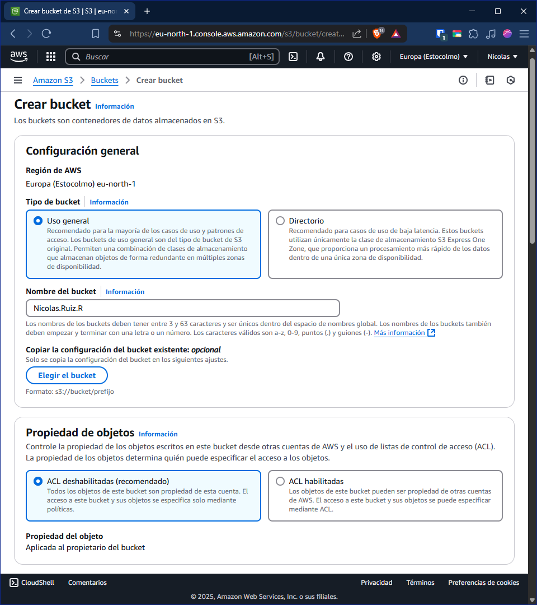

# Alojamiento de un sitio web estático

Un sitio web estático consiste en un página web hecha con HTML, CSS y JS. ¿Esto qué significa?, pues que el contenido _siempre_ va a ser el mismo, sin importar lo que el usuario haga. Evidentemente, no tiene conexión con ningún tipo de servidor, ya que no necesita conectarse a ninguna base de datos ni ejecutar código PHP, así que vamos a alojar nuestra pequeña página web en un _bucket S3_, que básicamente es un almacenamiento de datos en la nube.

---

Empezamos abriendo la consola del administrados:

Aquí dentro, nos hiremos al servicio mencionado, _bucket S3_ , y le daremos a _Crear bucket_:

Como simplemente vamos a alojar una página web estática, vamos dejar varias opciones por defecto, igualmente, animo a todos a leer lo que estás dejando por defecto, y modificarlo según tu caso. En el mío lo dejaré de la siguiente manera:

1. Configuración general.

- Región de AWS: **Europa (Estocolmo) eu-north-1**
Esta opción viene por defecto, y solo se puede cambiar si combiamos nuestra región arriba a la derecha, al lado de nuestro usurio.

- Tipo de bucket: **Uso general**
Como bien dice, es el ideal para la mayoría de los casos.

- Nombre del bucket: **nicolas.ruiz.r**
Es imporatante recalcar que, este nombre, debe ser **ÚNICO**, y no se puede solapar con ningún otro bucket creado, ya que, el nombre de este es parte de la URL.

2. Propiedad de objetos

- ACL: **habilitadas**
Esta opción sirve para especificar que archivos se pueden ver y cuales no, es importantisimo en caso de guardar varias cosas en un mismo bucket.

3. Configuración de bloqueo de acceso público para este bucket

Este apartado consiste en los permisos que le das a la gente con respecto al bucket. Yo voy a darles todos los permisos, lo cuál significa que, cualquiera que tenga el enlace del bucket, puede ver el contenido completo de este, siempre y cuando se especifique en la ACL. Como se trata de una página estática, no es _peligroso_ pero en caso de guardar achivos importantes como bakups o usarlo como git, configuradlo de la manera más segura posible.

4. Control de versiones de bucket

Esto sirve para que, al modificar el archivo original, se guarde una copia de este durante x días. Bastente útil en entornos de producción. Yo lo dejaré desactivado ya que, aún, no es relevante.

5. Etiqueta - opcional

Nunca está de más añadir etiquetas a los proyectos, sirven mucho más que un simple nombre, o peor, un identificativo numérico. Le pondré 2 etiquetas _Prueba_ y _Sitio-Web-Estatico_.

6. Cifrado predeterminado

- Tipo de cifrado: SSE-S3
El cifrado por defecto _SSE-S3_ ya utiliza el cifrado más seguro _AES-256_, dejamos este.

- Clave de bucket: Desactivar
Solo sirve con el cifradp SSE-KMS, pero en caso de utilzar este cifrado, esta opción haría menos consultas al KMS, lo que disminuaría el coste en dolares $.

La configuración quedaría de la siguiente forma:

> Aquí me equivoqué al sacar la foto, ACL habilitada y propietario del bucker preferido.

> Esta última opción sirve evitar el borrado accidental de archivos en el bucket durante un periodo de tiempo.

Una vez esté todo bien configurado le damos a crear, y, si el nombre es único, nos saldrá un nuevo bucket en la pantalla:

El problema es que viene deshabilitado por defecto, vamos a habilitarlo. Hacemos clic en él, le damos a propiedades y abajo del todo nos aparecerá la opción de _Alojamiento de sitios web estáticos_:

Le damos a _Editar_ y habilitamos el alojamiento estático. También, podemos configurar un nombre de indice y de error, por defecto, en todas las páginas, estos son _index.html_ y _error.html_, pero igualmente hay que especificarlo. Le damos a guardar los cambios.

Genial, ya estaría todo configurado, pero al entrar en la URL...

Y esto es así porque no tenemos ningún archivo cargado, debemos crearlo y subirlo.

> La URL está en _Propiedades_ > _Alojamiento de sitios web estáticos_, abajo del todo.

Una vez creado el _index.html_, en _Objetos_, le damos a cargar y subimos nuestro archivo, y por último, lo hacemos público mediante las ACLs:

Ahora si, si entramos en el enlace, nos saldrá la página que acabamos de subir:

Y ya estaría, podríamos hacer exactamente lo mismo en caso de error:

