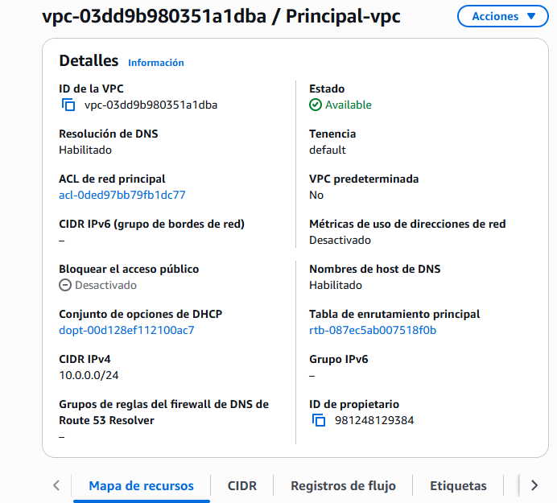
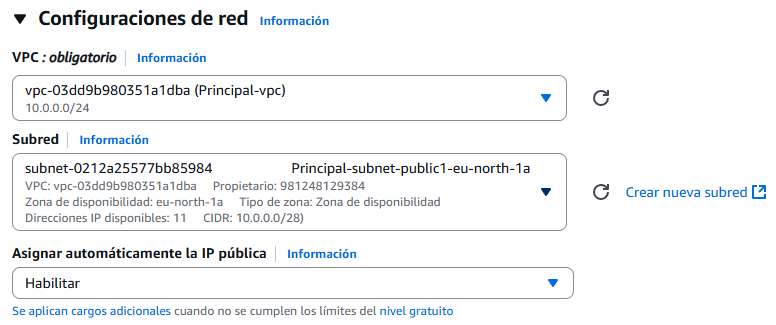

# Creación de una interconexión de VPC

Una VPC (Virtual Private Cloud) en AWS es una red virtual aislada dentro de la nube de Amazon, que permite lanzar y gestionar recursos como instancias EC2, bases de datos o balanceadores de carga. Funciona de manera similar a una red tradicional en un centro de datos, permitiendo definir rangos de IP, subredes públicas y privadas, tablas de rutas, gateways y reglas de firewall (grupos de seguridad y NACLs), otorgando control total sobre la conectividad interna y externa.

--

## 1. Creación de la VPC principal

Para comenzar, accedemos a la opción “VPC” y seleccionamos “Crear VPC”.

En este paso, se puede optar por una configuración simple o completa; en este caso, se selecciona la configuración completa para visualizar todas las opciones disponibles.

El primer parámetro a definir es el nombre de la VPC, que en este ejemplo será “Principal”.

El bloque CIDR IPv4 determina el rango de IPs de la red. Por defecto, AWS propone “10.0.0.0/16” (65,536 IPs), pero en función de las necesidades, se puede ajustar la máscara de subred. En este caso, se elige “10.0.0.0/24”, lo que proporciona 256 IPs. La opción de IPv6 se mantiene desactivada.

En cuanto a las zonas de disponibilidad, lo óptimo es seleccionar al menos dos, para garantizar la alta disponibilidad en caso de que una zona falle. Además, las instancias de base de datos requieren 2 zonas de disponibilidad para su correcto funcionamiento.

La cantidad de subredes dependerá de los requisitos del entorno. Para este ejemplo, se crea una subred pública y dos privadas.

## 2. Configuración de Gateways y Recursos Asociados

Los Gateways NAT permiten que las instancias en subredes privadas tengan acceso a internet. Se puede elegir implementar un Gateway en una sola zona o en todas las zonas de la red, según las necesidades de conectividad.

La vista previa quedaría tal que así:

Vemos varias cosas que no hemos configurado como tal, pero de momento vamos a crear la ``VPC``.

Genial, nuestra ``VPC`` se ha creado con exito, turno de revisar los recursos que se han creado automáticamente.

En la imagen vemos 3 tablas, 2 de ellas son las tablas privadas rutas solo llevan a la red que hemos creado:

A diferencia de la pública, que tiene una ruta al gateway:

> Una subred pública sin acceso a internet pierde su sentido y se comportaría como una red privada aislada.

Por último, se crea la puerta de enlace de internet, cuya función es permitir el acceso a internet de las subredes públicas.

Si quereís ver como se configuran las instancias que voy a crear, os dejo la [EC2](../prueba3/README.md) y la [RDS](../prueba4/README.md).

## 3. Configuración de Instancias EC2 y RDS

A continuación, se crean las instancias necesarias: una EC2 y una RDS. En la configuración de red de la instancia EC2, se debe seleccionar la VPC y la subred pública correspondiente, además de asignar una IP elástica para garantizar la conectividad externa. El grupo de seguridad puede mantenerse con la configuración predeterminada.

Para la instancia RDS, se especifica que la conexión se realice directamente desde la instancia EC2.

Esto sitúa la base de datos dentro de la VPC y permite configurar los grupos de subredes, seleccionando la VPC y las subredes previamente creadas.

> Las 2 son iguales.

## 4. Pruebas de Conectividad y Seguridad

Una vez configurado el entorno, se accede a la instancia EC2 mediante SSH para comprobar la conectividad a internet.

En la sección de conectividad y seguridad de la base de datos, se observa que no hay direcciones IP públicas, solo un endpoint, que será utilizado para las conexiones internas.

Se realiza una prueba creando una base de datos aleatoria en la RDS para verificar que ambas instancias RDS son independientes.

Finalmente, se comprueba que desde fuera de la red no es posible acceder a las bases de datos, confirmando así la seguridad de la configuración.

