# Creación de instancias EC2

Una instancia EC2 es, basicamente, una máquina virtual que actua de servidor. No tiene más. Estas se pueden modificar de muchas formas dependiendo de nuestras necesidades y de lo que estamos dispuestos a pagar.

En esta prueba vamos a configurar una EC2 de 0 y explicar todo lo posible acerca de estas.

---

Como antes, buscamos el servicio EC2 y le damos a iniciar instancia:

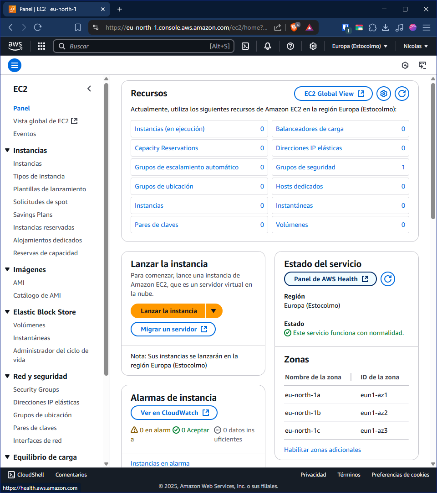

> A diferencia de antes, ahora no voy a crear algo con un objetivo, por lo que iré explicando las opciones y ya vosotros elegis la que más os convenza.

Empezamos por lp más básico, tenemos que ponerle un nombre y algunas etiquetas a nuestra instancia, recordad, poned etiquetas, no cuestan y ayudan mucho.

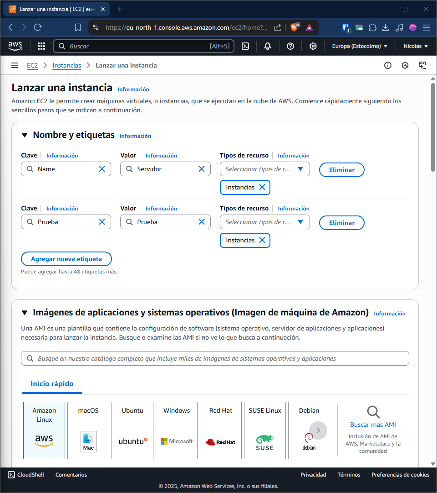

Ahora tenemos que elegir el sistema operativo que se va a instalar en el servidor, tenemos varios, muchos de ellos aptos para la capa gratuita, y, no solo podemos elegir el SO si no que también la versión específica de este.
Para esta prueba, voy a instlar la AMI más actual de Amazon Linux.

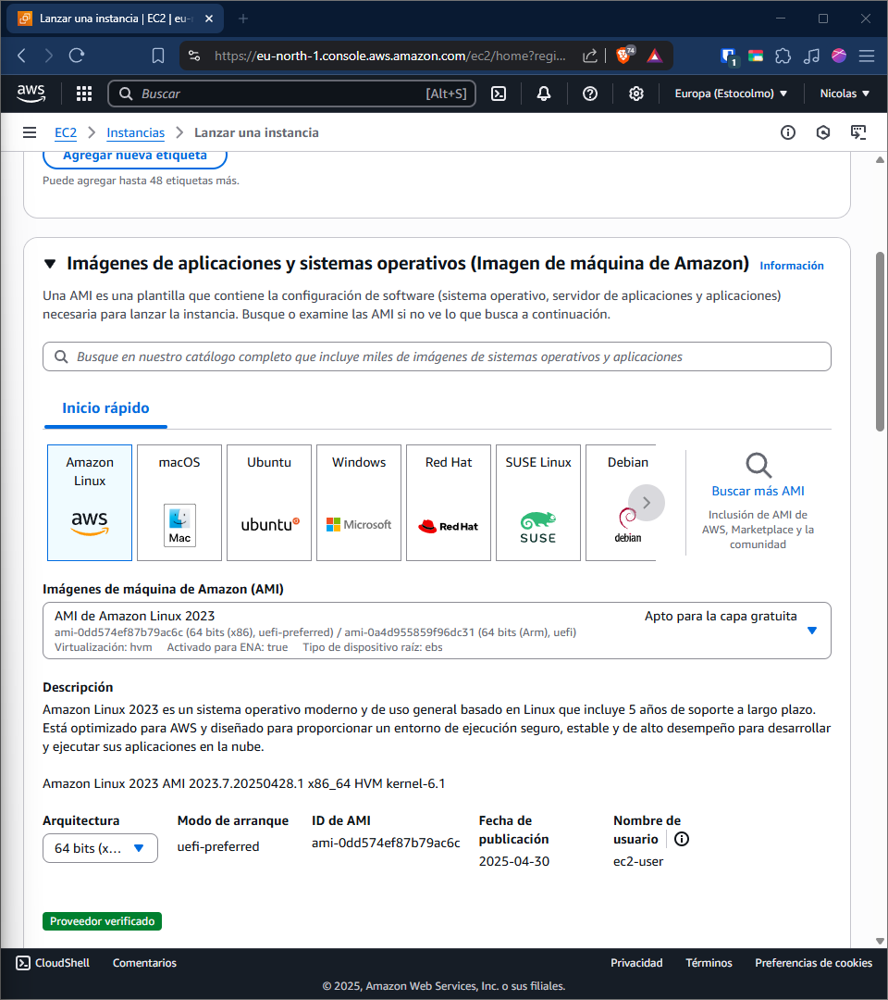

El tipo de instancia, consiste en la potencia que quieras que tenga el servidor. ¡Ojo! Mirad bien los precios por hora, evidentemento no cuesta lo mismo un t3.micro de 2vCPU y 1GB de RAM que un r7i.metal-48xl con 192vCPU y 1536GB de RAM, hay que ser conscientes de lo que necesitamos y de lo que estamos dispuestos a pagar.

Par de claves es un paso **OBLIGATORIO**, y no solo porque lo diga la web, si no porque es la forma más segura de autentificarte por SSH. Solo la persona que tenga el archivo generado puede acceder a al servidor, ni uno más. Obviamente, esto genera un problema, si ese archivo se pierde, el servidor queda inaccesible, ya que la plataforma no permite volver a descargar el archivo.

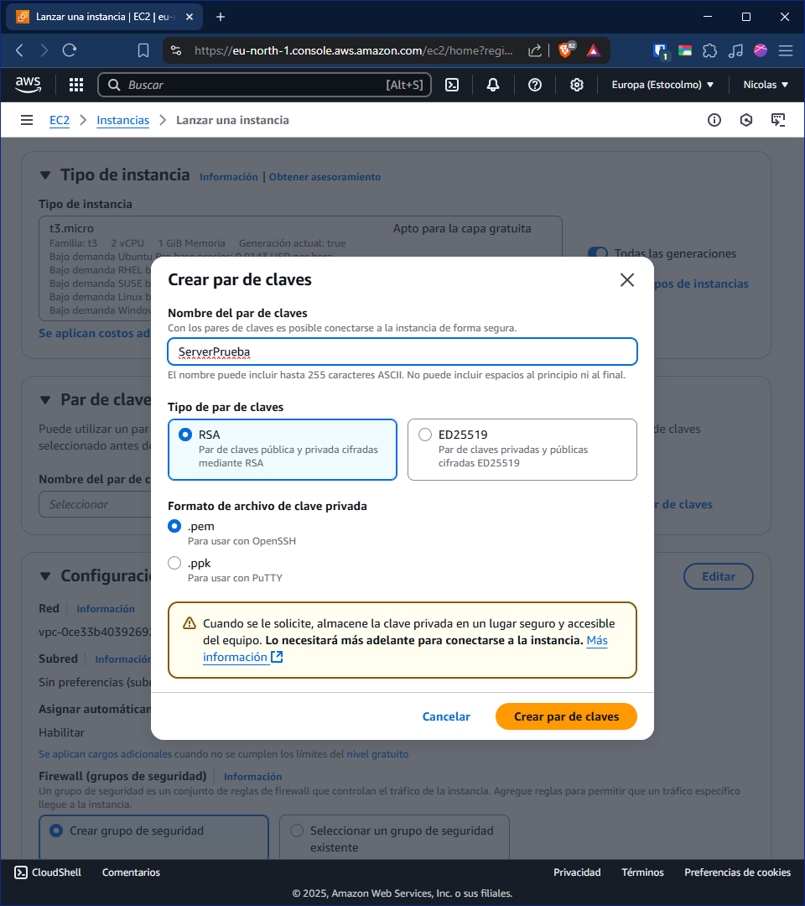

En el apartado de configuración de red, podemos asiganar distintas redes(VPC) y subredes de esta, pero estas 2, las trataré en otro apartado. Pasemos directamente a los grupos de seguridad, que literalmente, son las configuraciones del firewall de la máquina. Como aún no hemos creado ninguno, se creará uno nuevo, el cual en esta ventana, solo podemos permitir el tráfico ssh, https y http. Yo voy a desactivar todo para verlo luego de manera más completa.

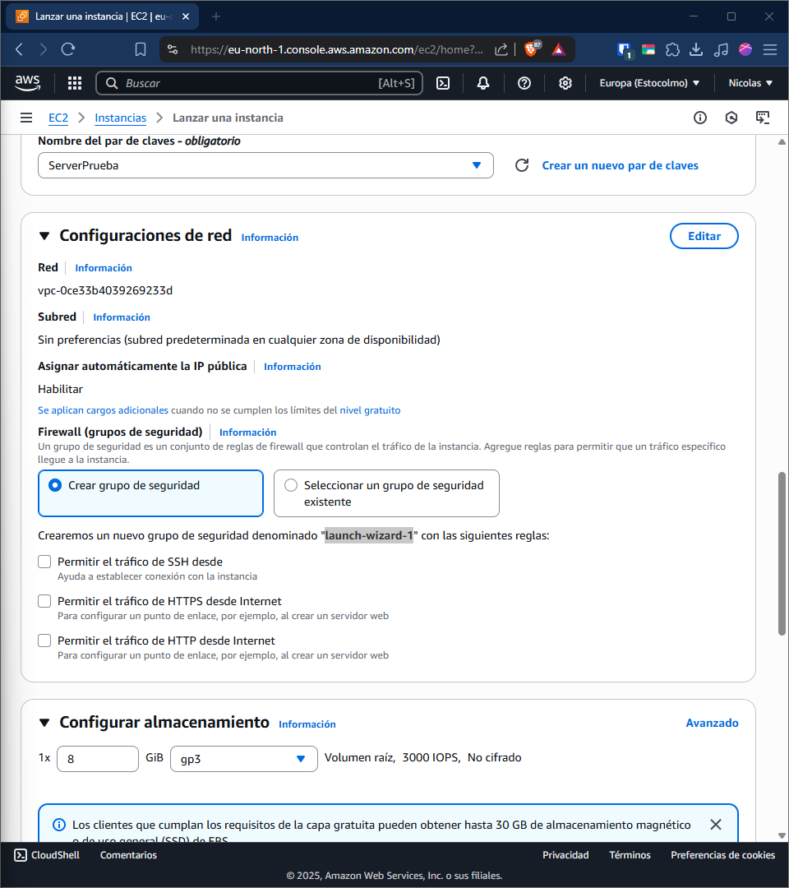

En cuanto a la configuración del almacenamiento, podemos elegir la cantidad de discos, el tamaño de estos y el tipo. Igual que antes, dependiendo de nuestras necesidades, pondremos uno u otro. Como apunte, la capa gratuita ofrece un total de 30GB de espacio en volumenes de uso general.

Y el último punto nos ofrece un resumen de lo que hemos configurado, y nos permite especificar la cantidad de instacias que vamos a crear con estas modificaciones.

Perfecto, ya tenemos la instancia creada, ahora vamos a configurar ese apartado que desactivé antes, el grupo de seguridad:

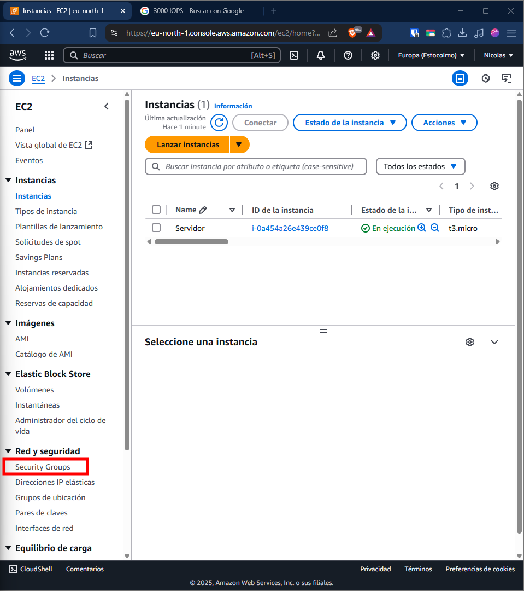

Aquí tendremos todos nuestros GS que habremos creado, por defecto viene uno creado `default` y ahora mismo, tendríamos que tener otro que se ha creado junto con la instancia. Este último es el que vamos a editar. Al hacer clic en ella, se nos abrirá una pestaña de _Reglas de entrada_, aquí configuraremos todas las conexiones entrantes a la máquina. Para este ejemplo, vamos a abrir el puerto 21(ftp), 22(ssh), 80(http) y 3306(mysql). Vamos a ello.

Lo primero que tenemos que hacer es darle a editar reglas de entrada, una vez dentro, AWS automatiza todo un poco, en _Tipo_ tenemos que poner el tipo de conexión que vamos a permitir, si es una estandar, el puerto se pondrá automaticamente, si no, lo tendremos que poner en `TCP personalizado` y ajustar nosotros mismo el puerto. En tipo de origen, le especificamos qué le va a llegar a esta instancia(IPv4, IPv6, nuestra IP o personalizado). Si elegimos `personalizado`, debemos especificar la IP que va a llegar, y por último, tenemos que poner una descripción de lo que hace esta regla. Yo se que tu sabes lo que hace, pero el que venga después de tí, no lo sobrá, o no con tanta facilidad.

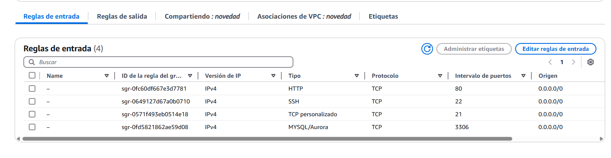

Así quedarían todas las reglas que, yo como ejemplo, he configurado. Es hora de probar que todo funcione. Para ello, lo primero que haremos es ver la IP del servidor, que se encuentra en el _Resumen de instancia_, y, a traves de una powershell, nos conectamos a esta IP median _SSH_:

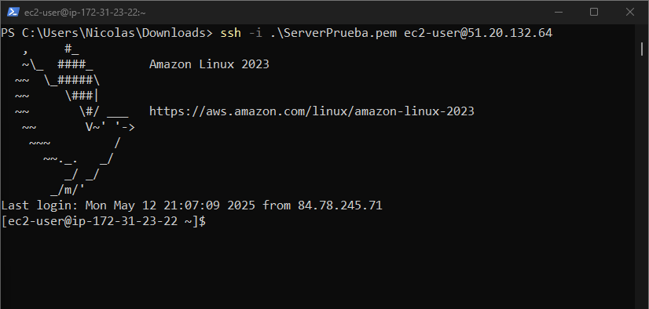

Genial, todo funciona correctamente, como últimos pasos, voy a intalar los servicios que dije anterior mente para comprobar su funcionamiento:

- ftp

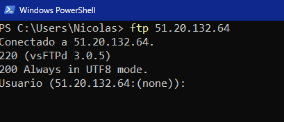

- http

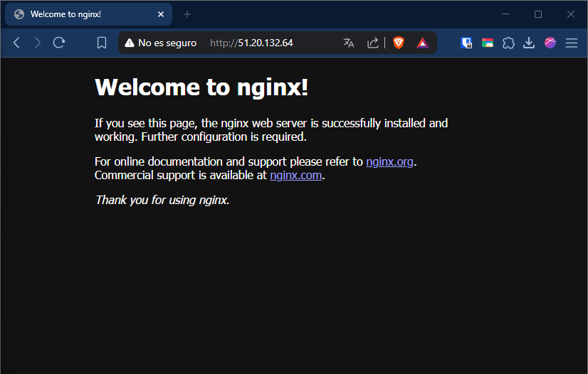

- mysql

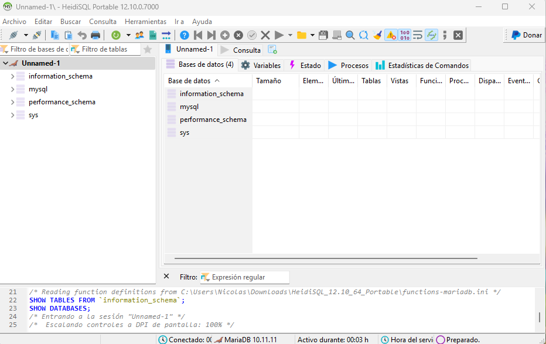