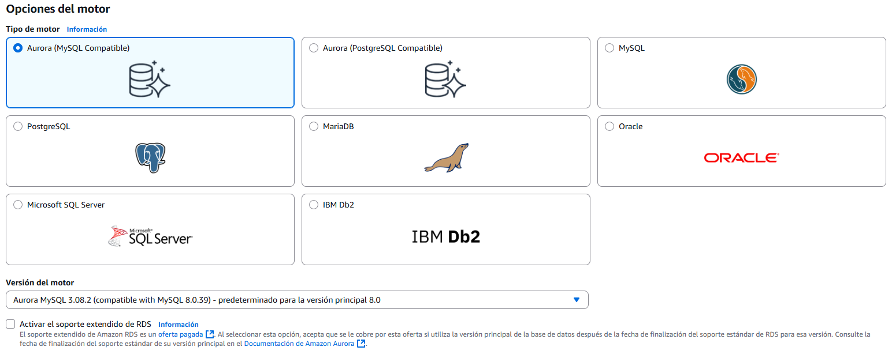
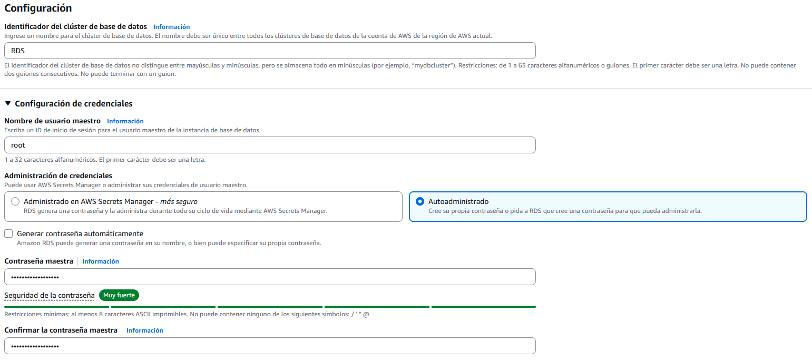
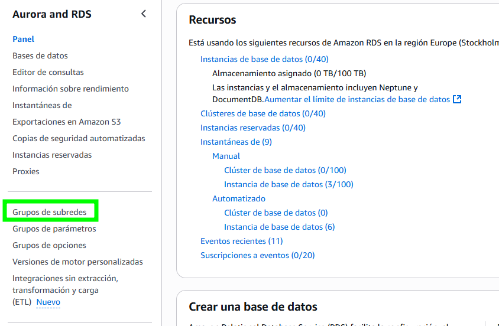
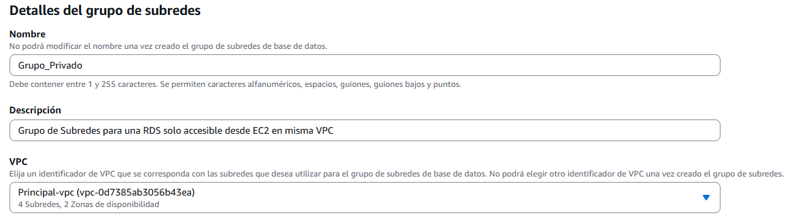
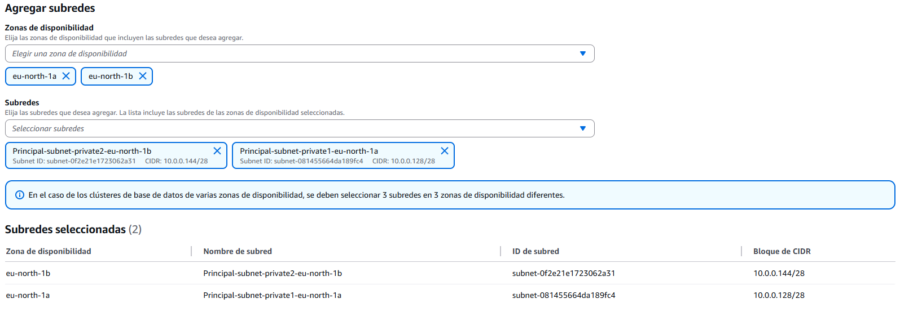
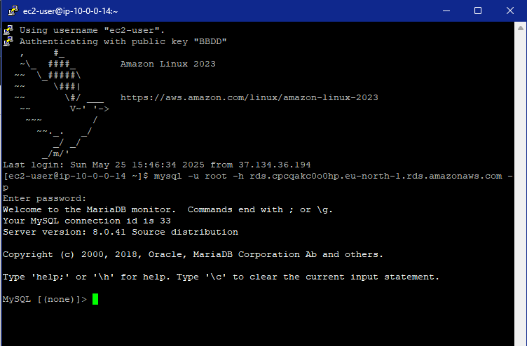

# Creación de una base de datos RDS

Amazon RDS (Relational Database Service) es un servicio gestionado de bases de datos relacionales en la nube de AWS. Permite desplegar, operar y escalar fácilmente motores como MySQL, PostgreSQL, MariaDB, Oracle, Microsoft SQL Server y Amazon Aurora. RDS automatiza tareas administrativas como actualizaciones, copias de seguridad, replicación, monitorización y alta disponibilidad, permitiendo al usuario centrarse en el desarrollo y no en la gestión de la infraestructura. Además, puede integrarse con redes VPC para mejorar la seguridad y segmentación de los recursos.

---

## 1. Proceso de Creación de la Base de Datos

Como dice el título, vamos a crear una base de datos (RDS) y, cuando terminemos, la conectaremos a una instancia ``EC2`` previamente creada. Todo esto estará segmentado por subredes: 1 pública para acceder a al ``EC2`` y una privada para aislar la base de datos.

Como crear la VPC ya lo vimos [aquí](../prueba2/), voy a pasar directamente a crear la base de datos.

El primer paso es acceder a la consola de RDS y seleccionar la opción para crear una nueva base de datos. AWS ofrece dos modos de creación: estándar y sencilla. Se recomienda la opción estándar para tener mayor control sobre la configuración.

De las primeras cosas que tendremos que elegir es el motor de la base de datos. Como dije antes existen varios modelos:

- Aurora (Mysql)
- Aurora (PostgreSQL)
- Mysql
- PostgreSQL
- MariaDB
- Oracle
- Microsoft SQL Server
- IBM Db2

En este ejemplo, se selecciona ``MySQL``, optando por la versión más reciente disponible para garantizar compatibilidad y soporte.

A continuación, se elige la plantilla de despliegue según el entorno: producción, desarrollo/pruebas o capa gratuita. Para entornos de prueba, se recomienda la opción de ``capa gratuita``, ya que simplemente estamos aprendiendo como crear bases de datos.

## 2. Configuración de la Instancia

Se definen el identificador de la instancia, el ``usuario`` administrador y la ``contraseña``. Es importante establecer una contraseña ``segura``, de al menos 8 caracteres, conforme a los requisitos mínimos de AWS.

Las ``clases`` de instancia disponibles incluyen:

- Clases r y x: priorizan la memoria RAM.
- Clases m: uso general.
- Clases t: ampliables, ideales para pruebas o cargas variables.

En el apartado de ``almacenamiento``, se selecciona el ``tipo`` (SSD, magnético, etc.) y el ``tamaño`` según las necesidades del proyecto.

## 3. Configuración de Conectividad y Seguridad

En el apartado de ``conectividad`` vamos a ajustar como la base de datos se comunica en la RED. Primeramente, vamos a configurar todo sin elegir la EC2, ya la elegiremos cuando esté creada para ver todos los apartados posibles. Elegimos la ``VPC`` que tengamos creada, en mi caso es la misma que creamos [aquí](../prueba2/), y en ``grupos de subredes``, tenemos que crearlos de 0, nos vamos a la pestaña principal de ``Aurora and RDS`` y en el panel de la izquierda elegimos ``Grupos de subredes``.

La configuración depende un poco de como hallamos creado la ``VPC``, las únicas opciones que pueden variar son las ``Zonas de disponibilidad`` y las ``Subredes``, que deben ser las mismas que pusimos al crear la ``VPC``. Mi configuración quedaría así:

Volvemos a la configuración de la RDS y ponemos el grupo que acabamos de crear, puede que tengamos que recargar la página. Elegimos el grupo de subredes que acabamos de crear, le quitamos el acceso público para que solo recursos del mismo ``VPC`` puedan acceder a la ``RDS``.

El ``grupo de seguridad``, crearemos uno desde 0 en una de las zonas de disponibilidad, y el resto podemos dejarlo por defecto.

## 4. Prueba de Conectividad

Una vez creada la base de datos, se conecta a una instancia ``EC2`` dentro de la misma ``VPC``. Para ello, se accede al apartado de ``recursos de computación conectados en la consola de RDS``, se selecciona ``Configurar conexión de EC2`` y se añade la máquina correspondiente. Tras configurar la conexión, se realiza una prueba de acceso desde la ``EC2`` para verificar la conectividad y el correcto funcionamiento de la base de datos:

Este procedimiento garantiza la creación segura y eficiente de una base de datos RDS, así como su integración con otros servicios de AWS, siguiendo las mejores prácticas de segmentación y seguridad en la nube.