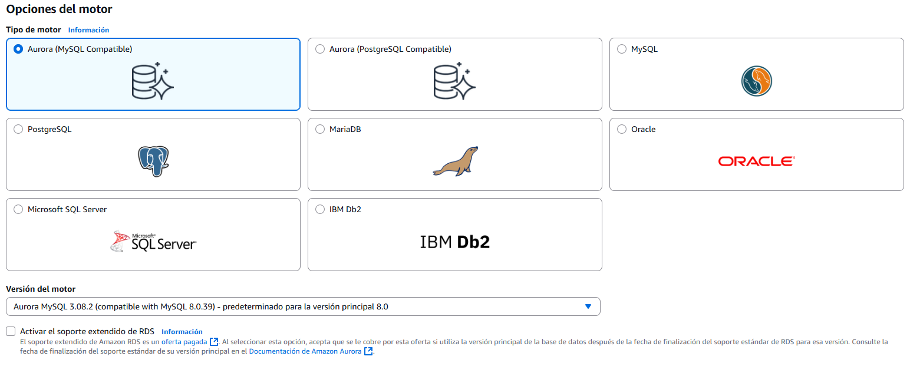
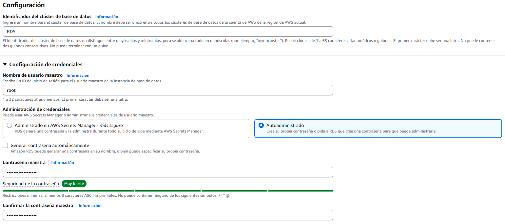
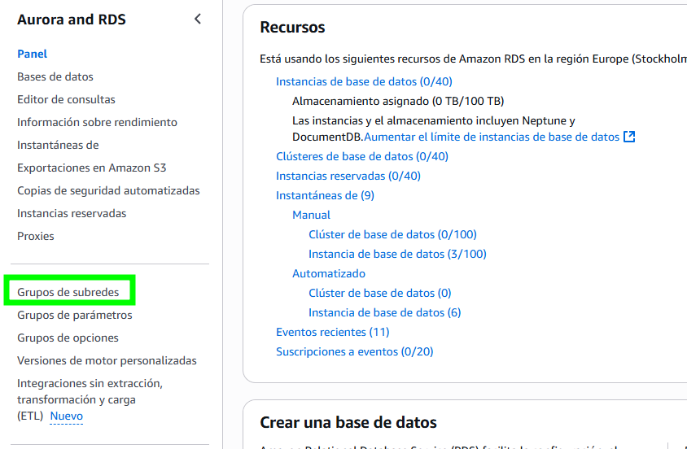
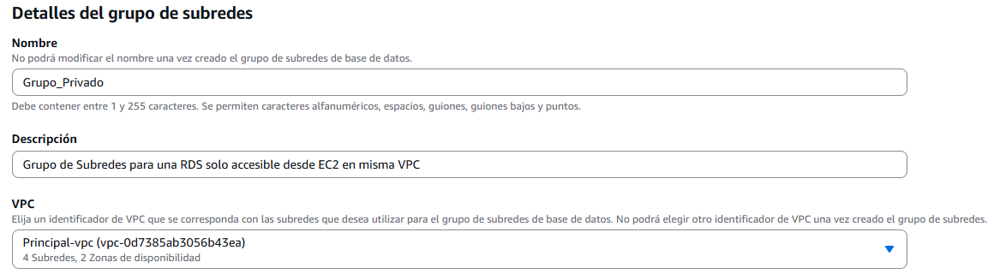
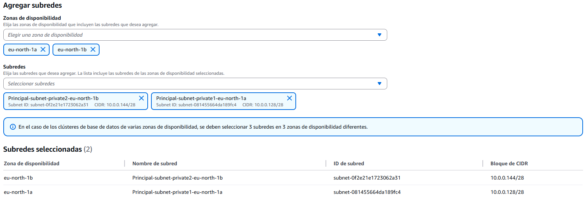
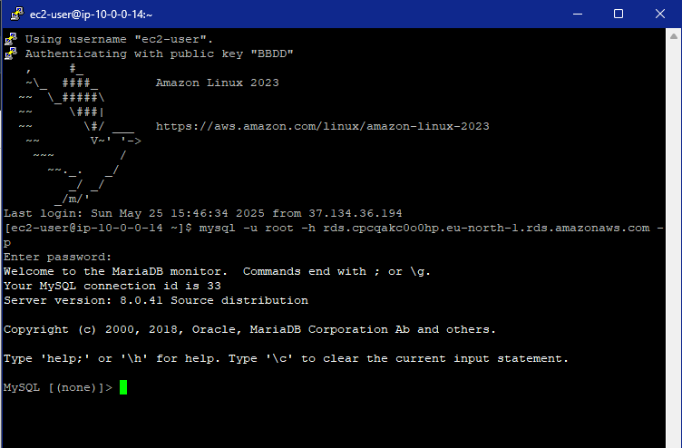

# Creación de una base de datos RDS

Amazon RDS (Relational Database Service) es un servicio gestionado de bases de datos en la nube de AWS que permite desplegar, operar y escalar fácilmente bases de datos relacionales como MySQL, PostgreSQL, MariaDB, Oracle, Microsoft SQL Server y Amazon Aurora. RDS se encarga de tareas administrativas como las actualizaciones del motor, backups automáticos, replicación, monitorización y alta disponibilidad, permitiendo a los usuarios centrarse en el desarrollo sin preocuparse por la gestión de la infraestructura subyacente. Además, puede integrarse con redes VPC como vimos en en una de las pruebas.

---

## 1. Creación de la RDS

Como dice el título, vamos a crear una base de datos (RDS) y, cuando terminemos, la conectaremos a una instancia ``EC2`` previamente creada. Todo esto estará segmentado por subredes: 1 pública para acceder a al ``EC2`` y una privada para aislar la base de datos.

Como crear la VPC ya lo vimos [aquí](../prueba2/), voy a pasar directamente a crear la base de datos.

Aquí nos pasa igual que anteriormente, nos dejan elegir entre creación estándar o sencilla. Yo evidentemente elegiré la estándar para configurar todo lo posible.

De las primeras cosas que tendremos que elegir es el motor de la base de datos. Como dije antes existen varios modelos:

- Aurora (Mysql)
- Aurora (PostgreSQL)
- Mysql
- PostgreSQL
- MariaDB
- Oracle
- Microsoft SQL Server
- IBM Db2

En esta ocasión elegiré ``Mysql`` (dependiendo de cual elijamos, nos apareceran diferentes opciones de configuración) y en la versión, podemos elegir la que queramos, aunque recomiendo elegir la más última.

Podemos cambiar entre plantilla de producción, desarrollo y pruebas y capa gratuita, dependiendo del estado del proyecto, elegiremos una u otra, como estoy en un ambiente de pruebas, elegiré la opción de ``Capa gratuita``.

Ahora nos pedirá el nombre de la instancia, el nombre de usuario admin y la formato de credenciales. ¡Ojo! sobra decirlo, pero si elegis ``Autoadministrado``, debéis poner una contraseña con un mínimo de seguridad, aunque por defecto nos obligan a poner una con almenos 8 caracteres.

En la ``configuración de la instancia`` tenemos las clases ``r y x``, las cuales priorizan la memoria RAM, ``m``, las cuales son más de uso general y las ``t``, las cuales son ampliables.

En ``almacenamiento`` debemos porner los requisitos que necesitemos, ``SSD``, ``máagnéticos``, ``tamaño`` ect.

En el apartado de ``conectividad`` vamos a ajustar como la base de datos se comunica en la RED. Primeramente, vamos a configurar todo sin elegir la EC2, ya la elegiremos cuando esté creada para ver todos los apartados posibles. Elegimos la ``VPC`` que tengamos creada, en mi caso es la misma que creamos [aquí](../prueba2/), y en grupos de subredes, tenemos que crearlos de 0, nos vamos a la pestaña principal de ``Aurora and RDS`` y en el panel de la izquierda elegimos ``Grupos de subredes``.

La configuración depende un poco de como hallamos creado la ``VPC``, las únicas opciones que pueden variar son las ``Zonas de disponibilidad`` y las ``Subredes``, que deben ser las mismas que pusimos al crear la ``VPC``. Mi configuración quedaría así:

Volvemos a la configuración de la RDS y ponemos el grupo que acabamos de crear, puede que tengamos que recargar la página. Elegimos el grupo de subredes que acabamos de crear, le quitamos el acceso público para que solo recursos del mismo ``VPC`` puedan acceder a la ``RDS``.

El ``grupo de seguridad``, crearemos uno desde 0 en una de las zonas de disponibilidad, y el resto podemos dejarlo por defecto.

Y ya estaría, hemos creado nuestra primera base de datos, vamos a probar que funcione correctamente conectandonos a ella desde la instancia ``EC2`` en la misma ``VPC``, pero primero, vamos a añadir la conexión de la ``EC2`` y la ``RDS``. Le damos a nuestra nueva base de datos y en el apartado de ``Recursos de computación conectados``, le damos a ``Configurar conexión de EC2`` y añadimos la máquina que esté en la misma ``VPC``, ahora si, hagamos la prueba:

Ya tendríamos nuestra base de datos conectado a nuestro servidor.